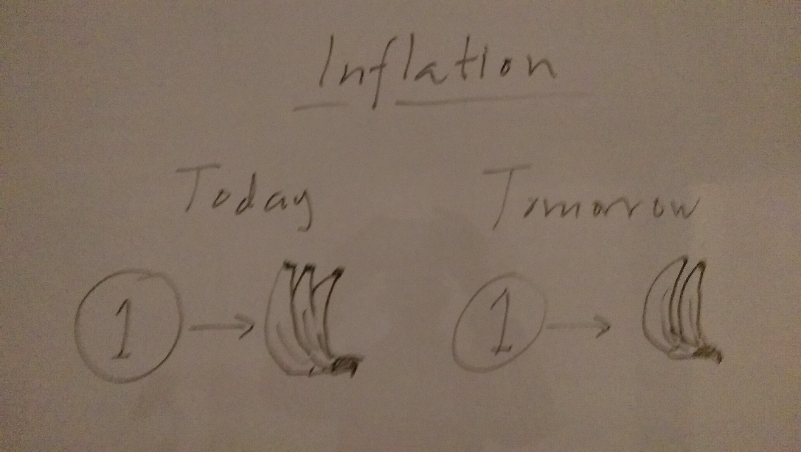
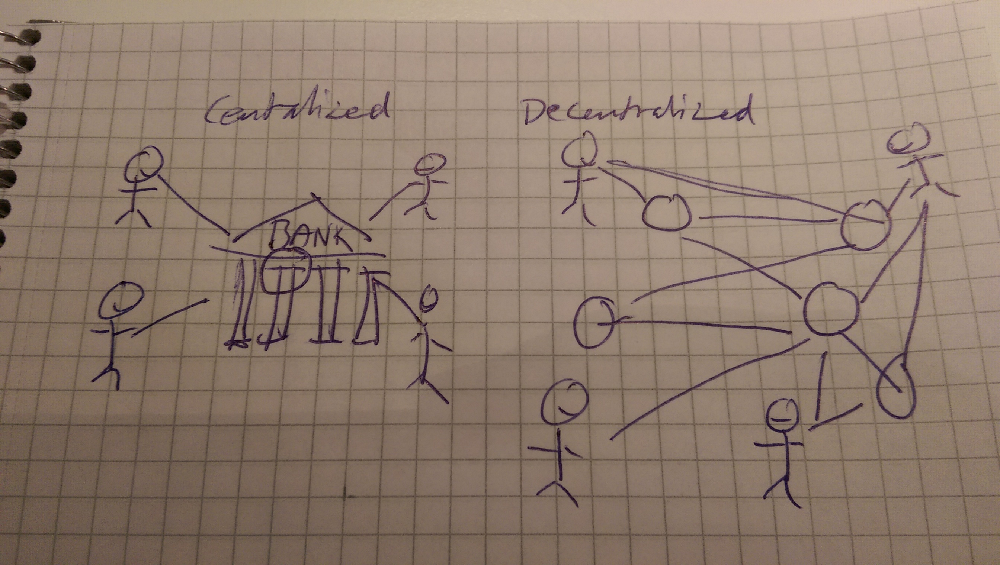
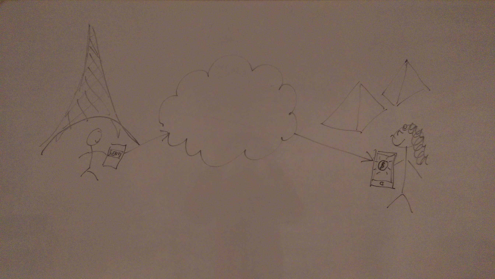
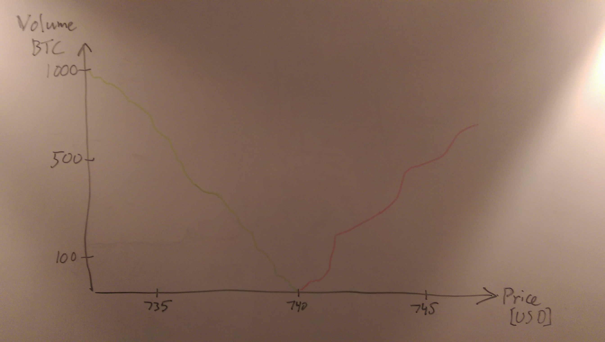
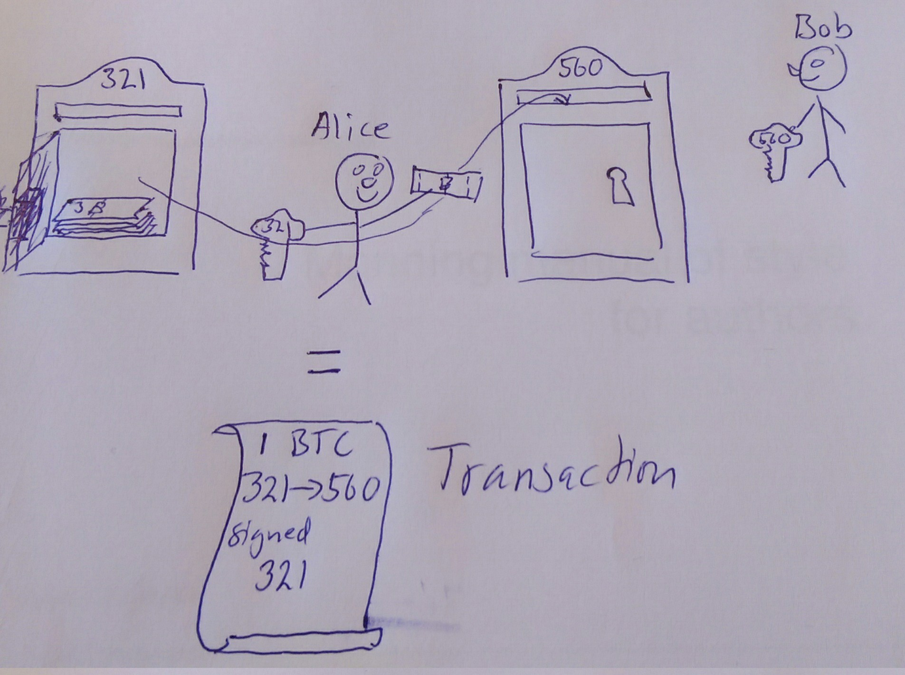
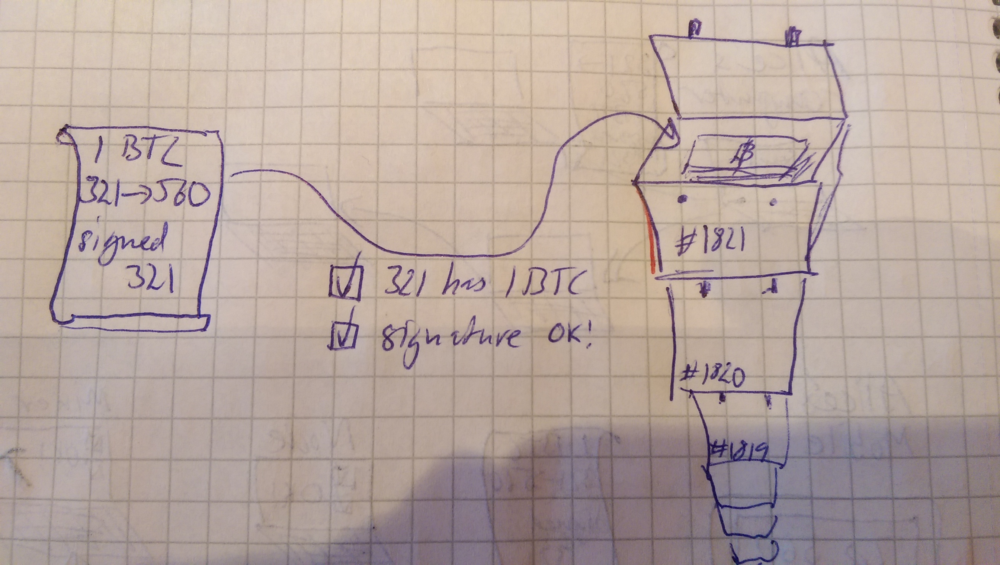
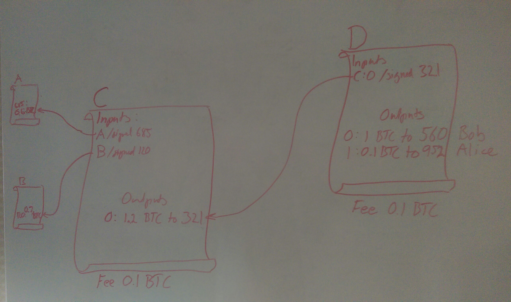

= Introduction to Bitcoin
:chapter: 1
:linkcss: 1
:stylesdir: style
:stylesheet: asciidoctor.css

This chapter covers

* getting to know Bitcoin
* the problems solved by Bitcoin
* getting the big picture

NOTE short version of MQR

== What is Bitcoin?

Bitcoin is an electronic cash system. It allows for people or
computers to move value between them without using a bank or some
other trusted third party. It resembles traditional bank notes and
coins in that way, but it is purely electronic and used over the
Internet. The currency unit is called bitcoin with lower-case _b_,
while the system is referred to as Bitcoin with capital _B_. The
currency is not tied to any specific _fiat currency_ like the US
dollar or the Chinese Renminbi; It has free floating exchange rates
against all fiat currencies. No government or company is controlling
Bitcoin. Instead, thousands of computers around the globe, running
Bitcoin software, collectively keeps the system working day and night,
seven days a week.

In October 2008, A pseudonym Satoshi Nakamoto, published a scientific
paper called "Bitcoin: A Peer-to-Peer Electronic Cash
System"footnote:[https://bitcoin.org/bitcoin.pdf] on an e-mail list
for cryptography related discussions. This paper described the vital
parts of Bitcoin. Later, in January 2009, Nakamoto published the first
software program to implement the described system. Bitcoin didn't get
much attention then, apart from within a very limited set of
cryptography experts. But gradually, as the system proved itself to be
working, more people got interested in it. Today, in 2017, several
millions of people are aware of Bitcoin and thousands of professionals
are working on Bitcoin related technology.

== Problems to solve

Bitcoin would not be this widespread today if it didn't solve real
problems for real people. There are several problems that is solved by
Bitcoin and it has the potential to solve several more in the
future. Let us focus on three commonly discussed problem areas
for now.

=== Inflation

The money supply in fiat currencies is sometimes used as a tool for
governments to extract value from its population to pay for expenses
like national debt or warfare. In some countries people are too aware
of this as they see their life savings diminish under so called
hyperinflation. Hyperinflation is usually initially driven by a rapid
increase in the money supply. An increasing money supply will usually
lead to a devaluation of the currency. This in turn pushes people to
exchange their local currency for goods or other currencies that
better holds value, which further drives the value of the currency
down.

.Inflation

An example of hyperinflation from recent time is the Zimbabwean dollar
that inflated nearly 80 billion percent during one and a half year,
that is a daily inflation rate of 98.01%. This is one of the most
extreme cases of inflation throughout history, but still today some
countries suffer from very high inflation. One of them is Venezuela
where its currency, the bolívar as of writing faces a 480% inflation
during 2016 and 2017 is forecast to suffer from 1640% inflation.

=== Borders

Moving value across borders using fiat currency is very hard and
expensive. If you want to send 1000 Swedish crowns (SEK) from Sweden
to a person in the Philippines, you can use a service like Western
Union for the transfer. At the time I investigated this, 1000 SEK was
worth 5305 Philippine Pesos (PHP) or 109 US dollars.

.Costs of sending 5305 PHP from Sweden to Philippines
|===
| Send from | Receive to | Received by recipient | Fees | Fees %

| Bank | Bank | 5109 PHP | 265 PHP | 4.9%

| Bank | Cash | 4810 PHP | 564 PHP | 10.5%

| Credit card | Cash | 4498 PHP | 876 PHP | 16.3%
|===

If the recipient have a bank account with the capability of receiving
international money transfer, we could get away with a 4.9% fee. A
typical remittance recipient will only be able to receive cash, which
pumps up the cost to 10.5% or 16.3% depending on how quick or
convenient you want it.

To contrast the above, moving fiat currency within the borders of a
state is usually very convenient. For example, you can hand over cash
directly to the recipient, or transfer money using some mobile app
made specifically for the currency. As long as you stay within one
country and one currency, fiat currencies usually does a pretty
good job.

=== Segregation

Not all people have bank accounts. Either because there is no bank 

Fiat services can chose who they are interacting with and what
services to provide.

== How does Bitcoin solve that?

NOTE Maybe rename heading to The Bitcoin approach

Bitcoin offers a fundamentally different model for money than
traditional financial institutions. Instead of a central organization
controlling the currency, like the US Federal Reserve, the control is
distributed among the thousands of computers, called _Bitcoin nodes_
or just _nodes_, participating in the Bitcoin system. This property,
called _decentralization_ opens up for two other interesting
properties: _limited supply_ and _global_.

=== Decentralized

No single node or group of nodes have more privileges or obligations
than any other node. This equality between nodes makes the system
_decentralized_, as opposed to _centralized_ systems like an Internet
Bank service or Google searches.

.Centralized and decentralized services

In centralized systems, servers controlled by a single entity, like a
bank or a search engine, provide a service to its users. It implies
that this single entity can decide who gets to use the service and
what the user is allowed to do. For example a national TV network may
chose to provide clips online only to people in a certain geographical
location.

The decentralized nature of the Bitcoin network is key, because no
single node or minority group of nodes can change the rules of the
currency, for example the _limited supply_ of about 21 million
bitcoins.

[id=limited_supply]
=== Limited supply

A hard promise of Bitcoin is that its monetary supply will not exceed
21 million bitcoins. People can be sure that if they own one bitcoin,
they know that they will _always_ own at least one 21 millionth of the total
supply of bitcoins. This feature is not found in any fiat currencies,
where decisions on the supply is made every so often by a company or a
state. Without a way to increase the money supply at will, the value
of a bitcoin will only be a function of supply and demand, and is
therefore much more resistant to hyperinflation.

The money supply of Bitcoin is actually not fixed today. It is
increasing at a diminishing rate, according to a predetermined
schedule and will eventually stop increasing around year 2140.

.The supply of bitcoins over time
image::images/money_supply.jpg[]

Throughout this book, you will learn how this is accomplished through
a process called _mining_, where some nodes in the Bitcoin network
perform costly work to ensure that no one changes the rules of
the network.

=== Global

Since Bitcoin is a system run by ordinary computers connected to the
Internet, the Bitcoin system is as global as the Internet itself. This
means that anyone with an Internet connection can send money to other
people across the world. No matter where they are or whom they are
sending money to, the system will treat every user equally. 

.Bitcoin is global

There is no difference between sending a bitcoin to someone in the
same room or sending it to someone on another continent. The
experience is the same: Money is sent directly to the recipient, who
will see the payment nearly instantaneously and after about 10 minutes
the recipient can be _sure_ that the money is hers. There is no way of
reversing the transfer.

NOTE Rupees 500/1000 invalid

== How is Bitcoin used?

So far we have touched on payments and savings as common use cases for
Bitcoin. As you will learn while reading this book, there are several
uses beyond that. We should note that since the _protocol_, a fancy
word for a _set of rules for communication_, for Bitcoin is open and
accessible to anyone with an Internet connection, innovation on top of
Bitcoin can take place anywhere and by anyone. We cannot predict how
Bitcoin will be used. Predicting Bitcoin's future is like predicting
in 1995 what the Internet will be used for in 20 years. Yet, there are
some distinguished use cases worth mentioning here.

=== Payments

NOTE Too negative tone here. Payments are still very possible and
convenient

Sending value from one person to another is the most basic use for a
currency. This is probably the most common use for Bitcoin as of
writing, but that may very well change in the future. This use case
currently has some limitations in that _transactions_, or money
transfers, are not instantaneously _confirmed_, but needs about 10
minutes to confirm. Another limitation is that the Bitcoin system have
limited capacity for how many transactions on average it can handle
per hour. These limitations are about to become history though, as new
innovations _on top_ of Bitcoin is evolving, this is described in
[REFERENCE to lightning chapter].

=== Savings

One interesting feature of bitcoin is that your money is kept by
storing a set of _private keys_. You chose how those private keys are
stored. You can write them on paper, or you can store them
electronically with a mobile app to have easy access to them. You can
also memorize the private keys. The keys are only needed when you want
to spend your money, they are also all that is needed to spend your
money. Keep them safe.

This makes Bitcoin ideal for saving. A simple way to save is to create
a private key and derive a _Bitcoin address_ from it. Your Bitcoin
address is a string of numbers and characters that you give to people
who want to send you money. Then you store the private key in a safe
and start sending bitcoins to your Bitcoin address. As long as your
private key is kept safe, your money is safe. There are a lot of
different saving schemes you can chose from to find the right balance
between security and convenience.

Because the money supply is limited, as described in
<<limited_supply>>, the risk of hyperinflation is very low. But the
value of a bitcoin will still fluctuate dramatically at times, because
of the highly speculative dimension of Bitcoin, see next section.

NOTE improve the risk paragraph.

Saving money in bitcoin is associated with a great deal of risk. As a
financial system, Bitcoin is like a toddler compared to traditional
financial institutions, who have developed over hundereds of
years. This means that there can be yet unknown issues with it. For
example, it might be discovered that some of the cryptograpy used in
Bitcoin may be flawed in some way, rendering Bitcoin insecure. If a
serious enough flaw in Bitcoin would surface, it could lose value
because of people selling off their bitcoin holdings, or your money
could be stolen due to the flaw.

=== Speculation

The world is full of people wanting to get rich quick. Bitcoin can be
very alluring to them, because of the _volatility_, tendency to
change, of the price of bitcoin. Looking at the history of Bitcoin, it
is very tempting to try to buy when it is low and sell when it is
high.

.Price since beginning of Bitcoin
image::images/price_graph.jpg[scale="5%"]

For a currency that can change this rapidly, it is very hard to
predict when a trend is about to change. In November 2013, the price
climbed from about $100 (US dollars) to over $1100 in a few
weeks. This was clearly a so called _bubble_, where people were afraid
of missing out on a great rise, so they bought in, driving the price
further up, until it eventually started dropping again. The drop to
50% of its peak value was just as quick as its rise. Fluctuations like
this is rarely driven by any specific news or technological
advancements, but from speculations.

Speculation can be fun but it is more like a lottery
than something to make a living off of.

=== Non-currency uses

Bitcoin is electronic cash, but this form of cash have a properties
that can be used for other things beyond money. This section covers a
few uses, but there are others including not yet invented uses.

==== Ownership

Bitcoin allows for arbitrary data to be stored in its _distributed
database_ called the _blockchain_[REFERENCE]. The blockchain is a big
pile of _transactions_, records of who transferred bitcoin to
whom. Every node (not entirely true, as you will learn) in the Bitcoin
network have a complete copy of the blockchain. This is not entirely
true, as you will learn later, but we can assume it is true for this
discussion. A small amount (80 bytes) of arbitrary data can be put
into a transaction, this data can be for example a chassis number of
a car. A transaction containing such data can be seen as a transfer of
ownership for that car from the sender of the bitcoin to the receiver.

==== Proof of existence

Using the same technique to store data in a transaction, you can prove
that a document existed prior to a certain point in time. You need to
create a small _cryptographic hash_ [REFERENCE], a kind of
fingerprint, of the document and store that in a transaction. All
transactions in the blockchain are timestamped. At any time in the
future you can prove that the document existed before the time of the
transaction by showing the document and the transaction containing the
hash. The person you are proving it to, will take the document and
calculate the cryptographic hash from it and verify that it matches
the one in the transaction.

==== Source of randomness

The blockchain could make a good source of randomness. You may want to
select what lunch restaurant youwill go to. INCOMPLETE

=== How is Bitcoin valued?

As you could read in secion <<speculation>>, the price of a bitcoin
can fluctuate quite dramatically. But where is this value actually
coming from? As with fiat currency, that has a value in terms of other
currencies. This value comes from a more or less free market of
currencies where banks and exchanges choses what rate they are willing
to trade the currencies in. A US exchange might want to sell 100 PHP,
Phillipinean Pesos, for 50 USD. Another exchange might be willing to
sell it for 49 USD. People wanting to buy PHP can then chose which
exchange to go to. If there are enough participants a free market, a
market price will emerge and adapt the price to new circumstances over
time.

The value of bitcion work in the same way. There are several Bitcoin
exchanges, mostly internet based. The simplest form of exchange will
list a buy price and a sell price. The sell price is what users of the
exchange will pay for a bitcoin and the buy price is what users will
get for a bitcoin. The exchange will usually have a slightly higer
sell price than buy price, this difference is called _spread_. This is
how the exchange makes a business out of exchanging.

There are also more advanced exchanges, called trading sites, where
users submit bids and asks. Bids are what users have said that they
are willing to pay for bitcoins, and asks are what users have said
that they are willing to sell bitcoins for. If the trading site can
match one user's bit to another user's ask, a trade happens. An
example of a bid is "I want to buy 10 BTC (bitcoin) for at most $740
each". Imagine a person wanting to sell her bitcoin, she can submit an
ask like "I want to sell 12 BTC for at least $740 each". The trading
site will discover this match and the bid will be fully executed. The
ask will be partially executed because the seller's ask was for
12 BTC. She then have to hope that another bid pops up that matches
her price for the remaining 2 bitcoins. The price of bitcoin on that
trading side is the price of the last trade. A trading site usually
publishes its _order book_, which can look something like this:

.Order book

It gives a user an overview of how much bitcoin is available at a
certain price and how much bitcoin can be sold at a certain price.

There are several trading sites and exchanges around the world. Most
of them are on the Internet, but there are some physical shops where
you can go in and exchange bitcoin and fiat currencies.

== The big picture

You will encounter several aspects of Bitcoin as you read this
book. Each chapter focuses on a specific commonly performed task, and
we will explore the technology behind that task as we stumble
upon it. This section is to give you a mental model to carry with you,
that we can refer to if needed.

[id=overview]
=== Overview

Let us start with a picture that visualizes an important process of
Bitcoin, a payment.

[id=bitcoin_payment]
.Bitcoin payment

In its most basic form, a Bitcoin _transaction_, or payment, can be
regarded as transferring money from one locked mailbox to
another. Yes, we are talking about _physical_ mailboxes for this
metaphore. Only the owner of a mailbox will be able to pull money out
of it using the key to the mailbox, but anyone is able to put money
into the mailbox throught the slot. The owner, Alice, of the key for
mailbox 321 in the picture, will withdraw 1 BTC from mailbox 321 and
deposit the bitcoin into mailbox 560. The movement of money from
mailbox 321 to mailbox 560 _is the Bitcoin transaction_. In digital
form, this transaction is a piece of data specifying

* the mailbox to withdraw from (321)
* the amount to withdraw (1 BTC)
* what mailbox to move the money to (560).
* a _digital signature_

The digital signature is a string of numbers that proves that the
sender actually owns the key to mailbox 321. The digital signature can
only be made using the correct key, the one that opens 321 in this
case. We will cover digital signatures in [REFERENCE].

The transaction is then sent to other _Bitcoin nodes_, computers also
running Bitcoin software, who will validate the transaction and pass
it on to its neighbouring nodes in the Bitcoin _peer-to-peer
network_.

[id=peer-to-peer-network]
.Peer-to-peer network
image::images/peer_to_peer_network.jpg[]

Nodes validate transactions by checking that the sender actually owns
the amount of money being sent (1 BTC in our example). This is done by
looking at previous transactions which it keeps track of. The node
also verifies that that the sender have signed using the correct key
(321).

Bob, the recipient of Alice's transaction will watch the Bitcoin
network. When a node he is connected to receives the transaction Bob
will be notified. His phone will beep and say, "You are about to
receive 1 BTC, stay tuned while the transaction is confirming".

Eventually the transaction will end up at one of several _miners_ who
will also validate the transaction. A miner is special Bitcoin node
that, apart from validating transactions flowing through it, also puts
the transactions in _blocks_. A block is another piece of data
containing a bunch of transactions. The blocks can be thought of as
transparent glass boxes on top of eachother. New transactions are put
in the topmost box.

.Mining

Every now and then a miner, any miner, on the network closes its box,
and sends it out on the Bitcoin peer-to-peer network just as Alice did
with her transaction, but now the miner is sending a block instead of
a transaction. It is purposefully _very hard_ to close a box. In fact
it is so hard that it takes on average 10 minutes before any miner has
managed to close its block. The process of closing a box is what we
refer to as _mining_. The purpose of mining is to ensure that everyone
on the peer-to-peer network _agrees on a common ordering of all
transactions_, to reach _consensus_.

When non-mining nodes receive a successfully closed box from another
node, they will verify the contents of it and that the box is properly
closed. Remember the boxes are of glass, validators can validate the
contents by looking in, without opening. If something is wrong with it
the block will be moved to the trash. If everything is ok with the
box, it will be put on top of the pile. If any of the nodes Bob is
connected to receives the block, he will be notified with "Hey! Your
transaction just got a _confirmation_". We will talk more about
confirmations later.

A mining node that receives the box will do the same as a non-mining
node, but it will discard its own open box before putting the incoming
closed box on top. The miner will then put a brand new open box on top
and start collecting transactions to put into the box and try to
seal it.

As more blocks gets closed on top of the block containing the payment
to Bob, he will get more confirmation notifications and after say 3
confirmations he is confident that the transaction is okay.

[id=wallets]
=== Wallets

Alice used a key to move money to Bob. This key needs to be stored in
a safe place only accessible by Alice. If someone else finds the key
they would be able to steal Alices money by sending them to
themselves. We call the secret key in Bitcoin a _private key_ because
it is ...private. A _Bitcoin wallet_ has the responsibility to store
private keys. Wallets can usually store arbitrarily many private keys.
They are called wallets, but they should really be called keyrings
because that is a more appropriate metaphore; It is where you keep
your keys, not your money. The money is stored publicly on bitcoin
nodes in the Bitcoin network. As you may have guessed, a private key
is actually not a physical key. It is a really big number, for example

 100726271638957209921666871088124746428337897490712549394597106827878301957289

The thing with private keys is that they are extremely hard to
guess. It is very hard to fathom the size of the above number. To give
you some perspective, the number of atoms in the known universe is
about the same order of
magnitudefootnote:[https://en.wikipedia.org/wiki/Observable_universe#Matter_content_.E2.80.93_number_of_atoms].

The simplest wallet imaginable is a piece of paper with a key, like
the number above, scribbled on it. This _paper wallet_ now stores
your key. But most wallets are electronic wallets used on mobile
phones or on laptops.

.Bitcoin wallet
image::images/bitcoin_wallet.jpg[]

Those wallet have some extra features apart from
just storing keys. Those features almost certainly include

* calculating a _Bitcoin address_ from a private key so that payments can be received
* creating, signing and sending transactions
* show the total balance of the wallet.

To send money to someone, you need to know that person's _Bitcoin
address_. Bob's fictous Bitcoin address is 560 in <<overview>>, but a
real Bitcoin address is usually 34 characters long. For example, the
Bitcoin address for the private key above is

 1G62SR2659vMEEu1rxyAGyCkh2yqNj8qBt

The Bitcoin address is easily derived from the private key, but you
cannot calculate or easily guess what private key a Bitcoin address is
derived from.

.Bitcoin address machine
image::images/bitcoin_address_machine.jpg[]

A very important feature of this machine is that every time you feed
it with the same private key, the exact same address is coming out of
it.

Anyone can build a Bitcoin address machine that works like in the
picture, but no one can build a machine that does the reverse. You
cannot calculate the private key from the Bitcoin address. This means
that it is safe to give your Bitcoin address to someone. After all,
that is how you receive money.

Most electronic Bitcoin wallets can be used to create transactions and
_broadcast_ them on the peer-to-peer network. Broadcast means that the
message is intended for all participants in the network.

=== Transactions

We have mentioned transaction already a number of times. Transactions
move money from one or more addresses to one or more other
addresses. It is a piece of data descibing how much bitcoin is
trasferred, what addresses they are transerred from, what addresses
they are transferred to. It also contains signatures from the previous
owners of the bitcoins.

A transaction does not only move bitcoins from a single address to
another single address, as in the overview above. In reality a
transaction have a number of _inputs_ and a number of
_outputs_. Inputs are the money that the transaction is spending, and
outputs are where the money is sent. An input basically contains two
things: a _reference to an output of another transaction_ and a
_signature_. Using inputs and outputs, transactions are linked to each other:

.Transactions

Some time ago transaction A moved 0.6 BTC to Bitcoin address 685 and
transaction B moved 0.8 BTC to Bitcoin address 120. Those two Bitcoin
addresses, 685 and 120, happens to be owned by the same person,
Zeus. It means that Zeus have possession of the private keys that the
two addresses were derived from using the "Bitcoin address machine"
described in <<wallets>>. Some time after transactions A and B
happened, Zeus wanted to pay 1.3 BTC to Alice. He does so by creating
a transaction with _two_ inputs, one referencing transaction A and one
referencing transaction B. He then adds one output of 1.3 BTC to
Alice's address 321. Note that the inputs sums to 1.4 BTC, while Alice
is only paid 1.3 BTC. This means that 0.1 BTC seems to be disappering
in this transaction. It is not disappearing; The 0.1 BTC is redeemed
by the miner who includes transaction C in a closed block. This is
known as the _transaction fee_. This fee is selected by the sender and
used to incentivize the miners to include the transaction in their
blocks. If no or a too low transacition fee is given, chances are that
the transaction will not _confirm_ in the _blockchain_, see next
section.

Now Zeus has created two inputs, totalling 1.4 BTC and one output of
1.3 BTC to Alice. What he's done so far can be done by anyone. No
secrets have been used. There's nothing stopping Ygdrasil from
creating a very similar transaction. Since transactions A and B are
publicly known, and visible in _the blockchain_, see next section,
Ygdrasil can make a transaction using the exact same inputs, and
instead of paying Alice, he pays himself 1.3 BTC. What's stopping him?
Signatures. In order to spend the input from transaction A, Zeus must
sign the input with his private key. He creates a signature with the
key for address 685 and adds it on the first input. Then he does the
same for the input from transaction B, but this time with the key that
corresponds to address 120. This cannot be done by Ygdrasil because he
does not have the required keys.

Transaction C have used A and B as inputs to finance a payment to
Alice at address 321. C Spent 1.4 BTC and send Alice 1.3 BTC, paying
0.1 BTC in transaction fee. Now Alice wants to do the payment to
Bob. She has got the 1.3 BTC she got from Zeus. She creates a
transaction with one input, referencing the first (and only) output of
C. Alice is spending 1.3 BTC, now she needs to specify how to spend
the 1.3 BTC. She adds one output of 1 BTC to Bob's address 560. This
is the actual payment she wanted to make, but now she has 0.3 BTC left
to spend in this transaction, and she don't want to give it all away
as transaction fee to the miner. She thinks 0.1 BTC is an appropriate
fee and incentive enough for miners to include her transaction, So
that leaves her with 0.2 to take care of somehow. The 0.2 bitcoins is
actually hers and she wants to keep them. She wants a _change_ of 0.2
BTC. Since transactions can have multiple outputs, she can send the
change to herself by adding another output of 0.2 BTC to one of her
own addresses. Users can have any number of addresses and they can
create new addresses as they please. She creates a new private key and
feeds it into the Bitcoin address machine which spits out address
952. She uses that address to pay herself the change in the second
output. She finishes the transaction by signing the only input with
her private key corresponding to address 321.

In order to maintain the limited supply, it is important that the
amounts of the outputs not exceed the amounts of the inputs, otherwise
we would create money out of thin air. There is one exception to this
rule, but we will cover that in [REFERENCE to Transactions]. The other
way around is perfectly okay on the other hand, as we have seen in
transaction C and D; The exess money will go to miners as transaction
fee.

[id=the_blockchain]
=== The blockchain

Typically transactions with zero confirmations, unconfirmed or 0-conf
transactions in Bitcoin lingo, can be acceptable for very small
amounts where the receiver trusts the sender. For example, a person
getting coffee money from a friend. Shops can also rely on unconfirmed
transactions for small amounts, but they sacrifice a little security
for the convenience and speed. One confirmation means that the
transaction is included in a closed block that has been broadcasted on
the Bitcoin network. This means that some miner have included the
transaction in a block and made a _significant effort_ in closing the
block. For each block built on top of this block, more effort is
committed to the block containing the transaction. As a rule of thumb,
6 confirmations is considered _very_ secure. We will dig deeper into
what this effort actually is later on.

The pile of blocks we have talked about is called _the
blockchain_. The _chain_ part or the word means that blocks are
chained together. Every block depends on, or builds upon, a previous
block. We have put them on top of eachother in the illustrations to
show how they form a higher and higher tower of power. Each block
contains a reference to its predecessor.

IMAGE of chained blocks

Each block have an identifier, block id or _block hash_, that is
calculated from the block. The caclulation resembles the Bitcoin
address machine in <<wallets>>, but you feed it a block instead of a
private key. The "Block hash machine" will spit out a very big (256
bits) number, the block hash. The term block hash comes from how the
Block hash machine works. The machine is a _cryptographic hash
function_ which you will learn more about in chapter [REFERENCE to
chapter on hash functions].

The numbers to the left of the blockchain are the block heights. The
height of a block is how far it is from the first block ever created,
the _genesis block_. The genesis block have height 0. The topmost
block in the picture is on height 1821, which means that it has 1821
blocks underneith it.

Imagine if you change anything in the block at height 1819. When you
change something in a block it is no longer the same block. The
modified block will have another block hash. Run the modified block
through the block hash mashine, and you will get a totally different
block hash. The blockchain will break and the block at height 1820
will point to nothing because you just modified the identifier it was
referring to.

The block hash serves another important purpose. Do you remeber how I
said that it is very hard to close a block, and that it is so hard
that it takes on average 10 minutes for the miners to close a single
block? The reason is that for a block to be valid, the block hash (a
big number, remember?) has to be lower than a certain threshold. If
this theshold is very small, the Block hash machine will unlikely
output a block hash lower than the threshold. It will most likely give
you a block hash that is higher than the theshold.

To produce a valid block you have to run your block through the block
hash machine. If the resulting block hash is too big, bigger than the
threshold, you have to try again. You try again by changing something
in the block, and run it again through the block hash machine. This
will give you a totally different block hash than the previous one,
because the block is changed. If the output from the machine is again
too big, you repeat again. You keep repeating this until you get a
block hash that is less than the theshold.

IMAGE of mining

When we do get a valid block hash, we have successfully closed the
block. This trial-and-error process is the effort we have talked about
in <<the_blockchain>>. This effort is referred to as _work_. Every
node is aware of the threshold, known as the _target_, and can
validate other miner's work. As the closed block is traveling the
Bitcoin network, nodes will validate that the block hash is lower than
the target. If not, the block will be dropped and network propagation
will stop. The block hash is the _proof of work_ that anyone can
validate by comparing to the target.

Why would anyone care to perform all this work to produce blocks? The
answer is economic incentives. For every block closed by a miner, that
miner will receive a reward in newly minted coins and collect the
transaction fees of all transactions in the block. _They earn bitcoins
by providing security to the network_.

The work performed by the mining nodes is required to 

In every new block the first transaction is the so called _coinbase 

Proof-of-work is the mechanism that makes _distributed consensus_
work.

The target is kept calibrated to that block are produced on average
every 10 minutes.

A miner closing a block is doing just that.

Who created the first block?
How was the first block created?
How did the Bitcoin network bootstrap?

The
block height is not actually part of the block

You can start thinking about what happens if two miners happens to
close one block each at about the same time and sends it out on the
network. Assume that a copy of Alice's transaction is included in both
of the two blocks. Which block will be the next block? Both of the two
blocks claims to be block #1821. Hint: the taller pile of blocks
will be considered more trustworthy than a smaller pile of blocks.

=== The peer-to-peer network
