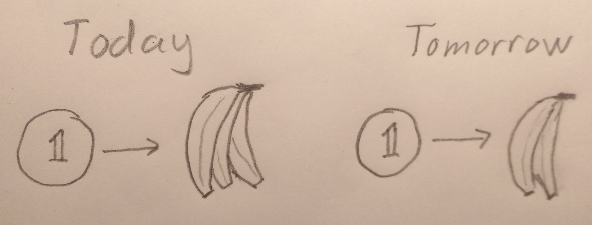
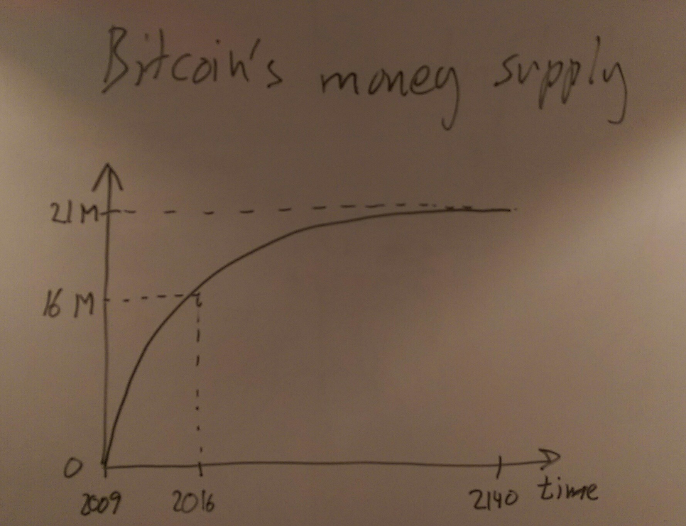
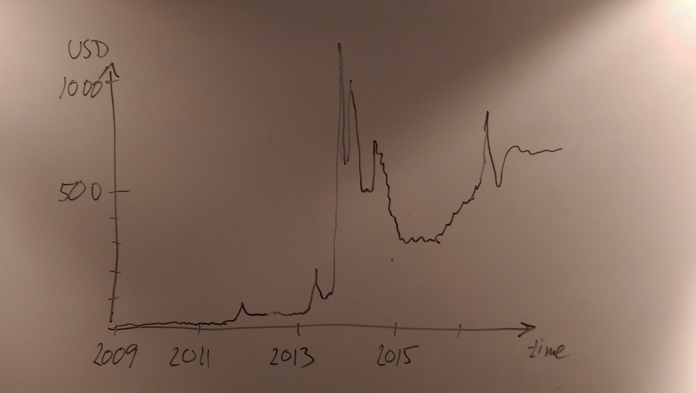
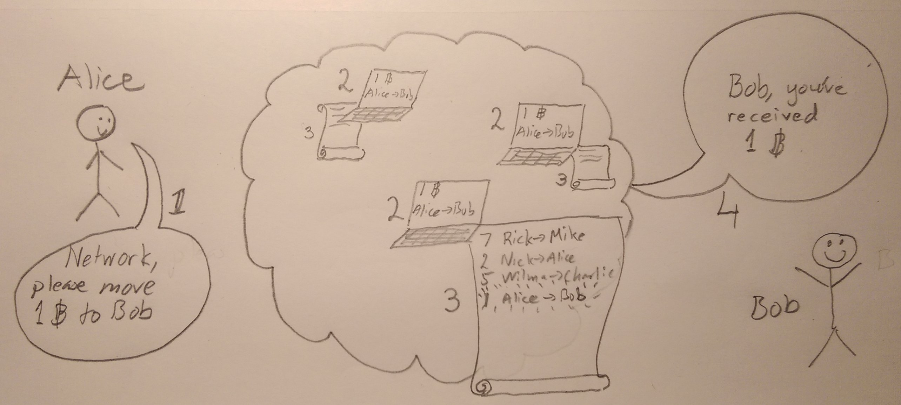
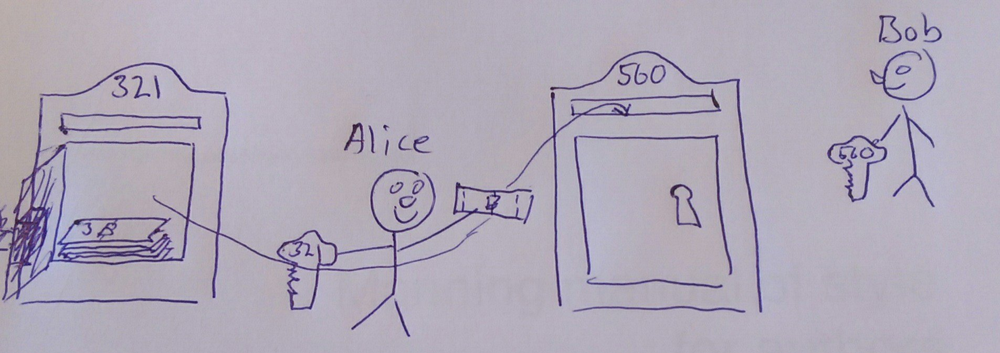
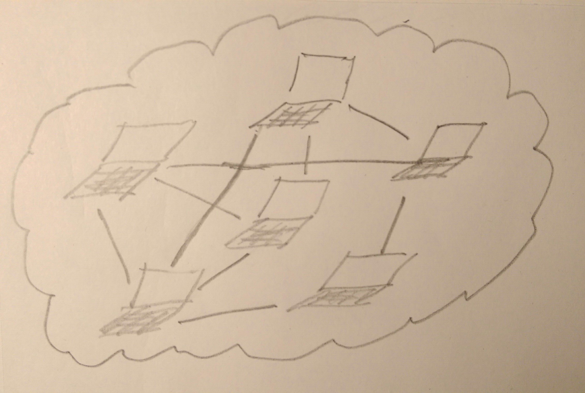
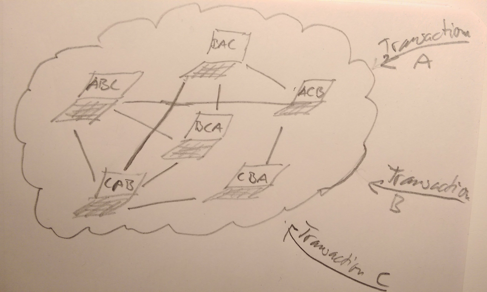
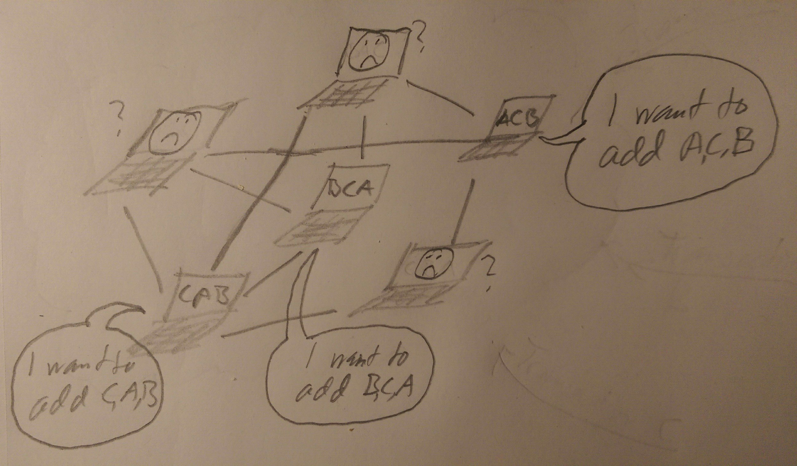
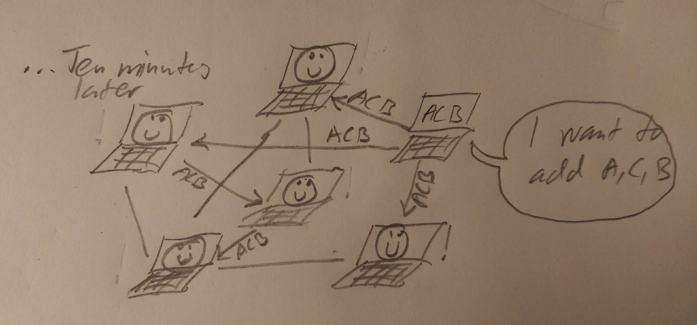
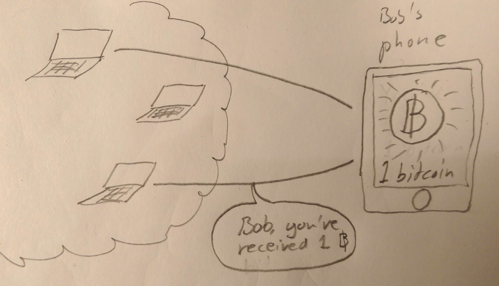

== Introduction to Bitcoin

This chapter covers

* getting to know Bitcoin
* the problems solved by Bitcoin
* getting the big picture

NOTE short version of MQR

=== What is Bitcoin?

Bitcoin is an electronic cash system. It allows for people or
computers to move value between each other without using a bank or
some other trusted third party. It resembles traditional bank notes
and coins in that way, but it is purely electronic and used over the
Internet. The currency unit is called bitcoin with lower-case _b_,
while the system is referred to as Bitcoin with capital _B_. The
currency is not tied to any specific _fiat currency_ like the US
dollar or the Chinese Renminbi; It has free floating exchange rates
against all fiat currencies. No government or company is controlling
Bitcoin. Instead, thousands of computers around the globe, running
Bitcoin software, collectively keeps the system working day and night,
seven days a week.

In October 2008, A pseudonym Satoshi Nakamoto, published a scientific
paper called "Bitcoin: A Peer-to-Peer Electronic Cash
System"footnote:[https://bitcoin.org/bitcoin.pdf] on an e-mail list
for cryptography related discussions. This paper described the vital
parts of Bitcoin. Later, in January 2009, Nakamoto published the first
software program to implement the described system. Bitcoin didn't get
much attention then, apart from within a very limited set of
cryptography experts. But gradually, as the system proved itself to be
working, more people got interested in it. Today, in 2017, several
millions of people are aware of Bitcoin and thousands of professionals
are working on Bitcoin related technology.

=== Problems to solve

Bitcoin would not be this widespread today if it didn't solve real
problems for real people. There are several problems that is solved by
Bitcoin and it has the potential to solve several more in the
future. Let us focus on three commonly discussed problem areas
for now.

==== Inflation

The money supply in fiat currencies is sometimes used as a tool for
governments to extract value from its population to pay for expenses
like national debt or warfare. In some countries people are too aware
of this as they see their life savings diminish under so called
hyperinflation. Hyperinflation is usually initially driven by a rapid
increase in the money supply. An increasing money supply will usually
lead to a devaluation of the currency. This in turn pushes people to
exchange their local currency for goods or other currencies that
better holds value, which further drives the value of the currency
down.

.Inflation

An example of hyperinflation from recent time is the Zimbabwean dollar
that inflated nearly 80 billion percent during one and a half year,
that is a daily inflation rate of 98.01%. This is one of the most
extreme cases of inflation throughout history, but still today some
countries suffer from very high inflation. One of them is Venezuela
where its currency, the bolívar as of writing faces a 480% inflation
during 2016 and 2017 is forecast to suffer from 1640% inflation.

==== Borders

Moving value across borders using fiat currency is very hard and
expensive. If you want to send 1000 Swedish crowns (SEK) from Sweden
to a person in the Philippines, you can use a service like Western
Union for the transfer. At the time I investigated this, 1000 SEK was
worth 5305 Philippine Pesos (PHP) or 109 US dollars.

.Costs of sending 5305 PHP from Sweden to Philippines
|===
| Send from | Receive to | Received by recipient | Fees | Fees %

| Bank | Bank | 5109 PHP | 265 PHP | 4.9%

| Bank | Cash | 4810 PHP | 564 PHP | 10.5%

| Credit card | Cash | 4498 PHP | 876 PHP | 16.3%
|===

If the recipient have a bank account with the capability of receiving
international money transfer, we could get away with a 4.9% fee. A
typical remittance recipient will only be able to receive cash, which
pumps up the cost to 10.5% or 16.3% depending on how quick or
convenient you want it.

To contrast the above, moving fiat currency within the borders of a
state is usually very convenient. For example, you can hand over cash
directly to the recipient, or transfer money using some mobile app
made specifically for the currency. As long as you stay within one
country and one currency, fiat currencies usually does a pretty
good job.

==== Segregation

Not all people have bank accounts. Either because there is no bank 

Fiat services can chose who they are interacting with and what
services to provide.

=== How does Bitcoin solve that?

NOTE Maybe rename heading to The Bitcoin approach

Bitcoin offers a fundamentally different model for money than
traditional financial institutions. Instead of a central organization
controlling the currency, like the US Federal Reserve, the control is
distributed among the thousands of computers, called _Bitcoin nodes_
or just _nodes_, participating in the Bitcoin system. This property,
called _decentralization_ opens up for two other interesting
properties: _limited supply_ and _global_.

==== Decentralized

No single node or group of nodes have more privileges or obligations
than any other node. This equality between nodes makes the system
_decentralized_, as opposed to _centralized_ systems like an Internet
Bank service or Google searches.

.Centralized and decentralized services
image::images/ch01/centralized_vs_decentralized.jpg[scale="5%"]

In centralized systems, servers controlled by a single entity, like a
bank or a search engine, provide a service to its users. It implies
that this single entity can decide who gets to use the service and
what the user is allowed to do. For example a national TV network may
chose to provide clips online only to people in a certain geographical
location.

The decentralized nature of the Bitcoin network is key, because no
single node or minority group of nodes can change the rules of the
currency, for example the _limited supply_ of about 21 million
bitcoins.

[id=limited_supply]
==== Limited supply

A hard promise of Bitcoin is that its monetary supply will not exceed
21 million bitcoins. People can be sure that if they own one bitcoin,
they know that they will _always_ own at least one 21 millionth of the total
supply of bitcoins. This feature is not found in any fiat currencies,
where decisions on the supply is made every so often by a company or a
state. Without a way to increase the money supply at will, the value
of a bitcoin will only be a function of supply and demand, and is
therefore much more resistant to hyperinflation.

The money supply of Bitcoin is actually not fixed today. It is
increasing at a diminishing rate, according to a predetermined
schedule and will eventually stop increasing around year 2140.

.The supply of bitcoins over time

Throughout this book, you will learn how this is accomplished through
a process called _mining_, where some nodes in the Bitcoin network
perform costly work to ensure that no one changes the rules of
the network.

==== Global

Since Bitcoin is a system run by ordinary computers connected to the
Internet, the Bitcoin system is as global as the Internet itself. This
means that anyone with an Internet connection can send money to other
people across the world. No matter where they are or whom they are
sending money to, the system will treat every user equally. 

.Bitcoin is global
image::images/ch01/global.jpg[]

There is no difference between sending a bitcoin to someone in the
same room or sending it to someone on another continent. The
experience is the same: Money is sent directly to the recipient, who
will see the payment nearly instantaneously and after about 10 minutes
the recipient can be _sure_ that the money is hers. There is no way of
reversing the transfer.

NOTE Rupees 500/1000 invalid

=== How is Bitcoin used?

So far we have touched on payments and savings as common use cases for
Bitcoin. As you will learn while reading this book, there are several
uses beyond that. We should note that since the _protocol_, a fancy
word for a _set of rules for communication_, for Bitcoin is open and
accessible to anyone with an Internet connection, innovation on top of
Bitcoin can take place anywhere and by anyone. We cannot predict how
Bitcoin will be used. Predicting Bitcoin's future is like predicting
in 1995 what the Internet will be used for in 20 years. Yet, there are
some distinguished use cases worth mentioning here.

==== Payments

NOTE Too negative tone here. Payments are still very possible and
convenient

Sending value from one person to another is the most basic use for a
currency. This is probably the most common use for Bitcoin as of
writing, but that may very well change in the future. This use case
currently has some limitations in that _transactions_, or money
transfers, are not instantaneously _confirmed_, but needs about 10
minutes to confirm. Another limitation is that the Bitcoin system have
limited capacity for how many transactions on average it can handle
per hour. These limitations are about to become history though, as new
innovations _on top_ of Bitcoin is evolving, this is described in
[REFERENCE to lightning chapter].

==== Savings

One interesting feature of bitcoin is that your money is kept by
storing a set of _private keys_. You chose how those private keys are
stored. You can write them on paper, or you can store them
electronically with a mobile app to have easy access to them. You can
also memorize the private keys. The keys are only needed when you want
to spend your money, they are also all that is needed to spend your
money. Keep them safe.

This makes Bitcoin ideal for saving. A simple way to save is to create
a private key and derive a _Bitcoin address_ from it. Your Bitcoin
address is a string of numbers and characters that you give to people
who want to send you money. Then you store the private key in a safe
and start sending bitcoins to your Bitcoin address. As long as your
private key is kept safe, your money is safe. There are a lot of
different saving schemes you can chose from to find the right balance
between security and convenience.

Because the money supply is limited, as described in
<<limited_supply>>, the risk of hyperinflation is very low. But the
value of a bitcoin will still fluctuate dramatically at times, because
of the highly speculative dimension of Bitcoin, see next section.

NOTE improve the risk paragraph.

Saving money in bitcoin is associated with a great deal of risk. As a
financial system, Bitcoin is like a toddler compared to traditional
financial institutions, who have developed over hundereds of
years. This means that there can be yet unknown issues with it. For
example, it might be discovered that some of the cryptograpy used in
Bitcoin may be flawed in some way, rendering Bitcoin insecure. If a
serious enough flaw in Bitcoin would surface, it could lose value
because of people selling off their bitcoin holdings, or your money
could be stolen due to the flaw.

==== Speculation

The world is full of people wanting to get rich quick. Bitcoin can be
very alluring to them, because of the _volatility_, tendency to
change, of the price of bitcoin. Looking at the history of Bitcoin, it
is very tempting to try to buy when it is low and sell when it is
high.

.Price since beginning of Bitcoin

For a currency that can change this rapidly, it is very hard to
predict when a trend is about to change. In November 2013, the price
climbed from about $100 (US dollars) to over $1100 in a few
weeks. This was clearly a so called _bubble_, where people were afraid
of missing out on a great rise, so they bought in, driving the price
further up, until it eventually started dropping again. The drop to
50% of its peak value was just as quick as its rise. Fluctuations like
this is rarely driven by any specific news or technological
advancements, but from speculations.

Speculation can be fun but it is more like a lottery
than something to make a living off of.

==== Non-currency uses

Bitcoin is electronic cash, but this form of cash have a properties
that can be used for other things beyond money. This section covers a
few uses, but there are others including not yet invented uses.

===== Ownership

Bitcoin allows for arbitrary data to be stored in its _distributed
database_ called the _blockchain_[REFERENCE]. The blockchain is a big
pile of _transactions_, records of who transferred bitcoin to
whom. Every node (not entirely true, as you will learn) in the Bitcoin
network have a complete copy of the blockchain. This is not entirely
true, as you will learn later, but we can assume it is true for this
discussion. A small amount (80 bytes) of arbitrary data can be put
into a transaction, this data can be for example a chassis number of
a car. A transaction containing such data can be seen as a transfer of
ownership for that car from the sender of the bitcoin to the receiver.

===== Proof of existence

Using the same technique to store data in a transaction, you can prove
that a document existed prior to a certain point in time. You need to
create a small _cryptographic hash_ [REFERENCE], a kind of
fingerprint, of the document and store that in a transaction. All
transactions in the blockchain are timestamped. At any time in the
future you can prove that the document existed before the time of the
transaction by showing the document and the transaction containing the
hash. The person you are proving it to, will take the document and
calculate the cryptographic hash from it and verify that it matches
the one in the transaction.

===== Source of randomness

The blockchain could make a good source of randomness. You may want to
select what lunch restaurant youwill go to. INCOMPLETE

==== How is Bitcoin valued?

As you could read in secion <<speculation>>, the price of a bitcoin
can fluctuate quite dramatically. But where is this value actually
coming from? As with fiat currency, that has a value in terms of other
currencies. This value comes from a more or less free market of
currencies where banks and exchanges choses what rate they are willing
to trade the currencies in. A US exchange might want to sell 100 PHP,
Phillipinean Pesos, for 50 USD. Another exchange might be willing to
sell it for 49 USD. People wanting to buy PHP can then chose which
exchange to go to. If there are enough participants in a free market,
a market price will emerge and adapt the price to new circumstances
over time.

The value of bitcion work in the same way. There are several Bitcoin
exchanges, mostly internet based. The simplest form of exchange will
list a buy price and a sell price. The sell price is what users of the
exchange will pay for a bitcoin and the buy price is what users will
get for a bitcoin. The exchange will usually have a slightly higer
sell price than buy price, this difference is called _spread_. This is
how the exchange makes a business out of exchanging.

There are also more advanced exchanges, called trading sites, where
users submit bids and asks. Bids are what users have said that they
are willing to pay for bitcoins, and asks are what users have said
that they are willing to sell bitcoins for. If the trading site can
match one user's bid to another user's ask, a trade happens. An
example of a bid is "I want to buy 10 BTC (bitcoin) for at most $740
each". Imagine a person wanting to sell her bitcoin, she can submit an
ask like "I want to sell 12 BTC for at least $740 each". The trading
site will discover this match and the bid will be fully executed. The
ask will be partially executed because the seller's ask was for
12 BTC. She then have to hope that another bid pops up that matches
her price for the remaining 2 bitcoins. The price of bitcoin on that
trading side is the price of the last trade. A trading site usually
publishes its _order book_, which can look something like this:

.Order book
image::images/ch01/order_book.jpg[scale="5%"]

It gives a user an overview of how much bitcoin is available at a
certain price and how much bitcoin can be sold at a certain price.

There are several trading sites and exchanges around the world. Most
of them are on the Internet, but there are some physical shops where
you can go in and exchange bitcoin and fiat currencies.

=== The big picture

You will encounter several concepts in Bitcoin as you read this
book. Each chapter focuses on a specific commonly performed task, and
we will explore the concepts behind that task as we stumble upon
them. This section is to give you a mental model to carry with you,
that we can refer to if needed.

The Bitcoin network validates and confirms payments. The Bitcoin
network is a network of computers running Bitcoin software. A payment
starts with a user, Alice in our example, asking the Bitcoin network to
move money from her to Bob.

Let us follow Alice's payment from Alice to Bob:

1. Alice asks the Bitcoin network to move 1 bitcoin from her to Bob.
2. The computers in the network check that Alice actually has the
money to send and that she is authorized to send them.
3. Each computer update its own copy of the Bitcoin ledger with the
new transaction information.
4. The network notifies Bob that he has received 1 bitcoin.

Note how Alice does not really _send_ 1 bitcoin to Bob, but asks the
Bitcoin network to subtract 1 bitcoin from Alice's balance, and to add
1 bitcoin to Bob's balance in the Bitcoin ledger. The Bitcoin ledger
is a database that each computer in the Bitcoin network has a
copy of. This ledger contains historic information about previous
payments, and new payments are added to it every now and then. The
computers in the Bitcoin network constantly try to keep this ledger up
to date between each other.

We will go through these steps a bit closer in the next four
sections, one step per section.

[id=overview]
==== Transactions

Step 1 of the process is when Alice asks the network to move 1 bitcoin
to Bob. She asks by sending a Bitcoin _transaction_ to the Bitcoin
network. The transaction contains instructions on how to move the
money in the ledger and a proof that Alice actually is authorized to
move the money. Let us start with a picture that visualizes the
transaction.

[id=bitcoin_payment]
.Bitcoin payment

[NOTE maybe ditch this mailbox analogy, it's not perfect and may
actually confuse more than help]

The Bitcoin _transaction_, or payment, can be regarded as transferring
money from one locked mailbox to another. Yes, we are talking about
_physical_ mailboxes for this analogy. Only the owner of the key to a
mailbox will be able to pull money out of that mailbox, but anyone is
able to put money into the mailbox through the slot. Alice, the owner
of the key to mailbox 321 in the picture, will withdraw 1 BTC from
mailbox 321 and deposit the bitcoin into mailbox 560, Bob's
mailbox. She is the only one who can do that because only she has the
key to mailbox 321. In digital form, this transaction is a piece of
data specifying

* the mailbox to withdraw from (321)
* the amount to withdraw (1 BTC)
* what mailbox to move the money to (560).
* a _digital signature_

The digital signature corresponds to Alice opening mailbox 321 with her
key to pull out a bill. Only she can pull out a bill from
mailbox 321. Likewise, only she can create the digital signature.

Alice sends this transaction to one or more _Bitcoin nodes_, computers
in the Bitcoin network. This is [REFERENCE step 1 in The Big Picture]
where Alice asks the network to move money.

==== The Bitcoin network

Alice have already sent a transaction to a number of Bitcoin nodes. In
step 2 of the process, each node checks that the transaction is
valid. They do that by consulting their copy of the ledger, to see if

* mailbox 321 contains the money she wants to spend.
* she has successfully unlocked the mailbox.

Each node doing these checks are part of the Bitcoin network. Nodes
connect to some other nodes and together they form a network, the
Bitcoin network.

[id=bitcoin-network]
.The Bitcoin network

If all checks pass, a node will forward the transaction to the nodes
it is connected to in the Bitcoin network. Alice's transaction would
shortly have travelled the whole network while being validated by each
node along the way.

==== The blockchain

In step 3 each node updates its local copy of the ledger with the
information in Alices transaction. The ledger is called _the
blockchain_. The name will be explained in later chapters. It is not
as straight forward as it may seem to update the blockchain. Alice's
transaction is not the only transaction that goes on. There are
possibly thousands of transactions in-flight at the same time in the
Bitcoin network. If all nodes would just update their copy of the
blockchain as they receive transactions the copies would not remain
copies for long. The transactions may come in different order on
different nodes:

[id=transaction-ordering]
.Transactions unordered

To coordinate the ordering of transactions, one node takes the lead
saying "I want to add these 3 transactions to the blockchain in the
order A, C, B!" to all its network neighbors. This message is sent out
by the leader on the network, just as Alice's transaction was by
Alice, until all nodes has received it. As nodes see this message they
update their copy of the blockchain according to that message.

Not all nodes want to take the lead, but some of them do. We call them
_miners_. Imagine if all miners tried to take the lead at the same
time. Chaos would emerge where hundereds of computers simultaneously
say "I want to add these XYZ transactions to the blockchain in this
specific order". Nodes receiving all those messages would not know
which of them to use.

[id=block-race]
.Chaos among miners

To avoid this chaos, miners are required to perform work before taking
the lead. This means that taking the lead is not as easy as just
shouting on the network, the miner must first perform hard work to
solve a mathematical problem by trial-and-error. The work is so hard
that it takes about 10 minutes before _any miner_ on the whole network
can send out their message. The result of this is that the miners
becomes much less chatty, and usually only one sends out their message
at a time.

[id=block-race-solution]
.Solving the chaos

Now, since the chaos is solved, nodes can follow the only leader and
update their copies of the blockchain with the transactions sent from
the leader. Alice's transaction is one of them. It's time to notify Bob!

==== Wallets

Bob and Alice are users of the Bitcoin network, and they need some
computer program to interact with the network. Such a program is
called a _Bitcoin wallet_. There are several different Bitcoin wallets
for several different devices, like mobile phones and desktop
computers.

At this stage in the payment process, all nodes in the network have
updated their local copy of the blockchain. Now, in step 4, the
network needs to notify Bob that he has received one bitcoin.

[id=wallet-connection]
.Notifying Bob

Bob's wallet is connected to some of the nodes in the Bitcoin network, just
like a node is connected to some nodes. When a transaction concerning
Bob is added to the blockchain, the nodes that Bob's wallet is
connected to will notify Bob's wallet. The wallet will then display a
message to Bob that he just received one bitcoin.

As noted at the start of this section, Alice also use a wallet. Her
wallet will also be notified of her own transaction, but there's one
more very important thing that her wallet does. It holds her keys
for her. The keys, as discussed in secion [REFERENCE to Transactions
section] are used to create digital signatures and those keys need to
be stored securely so that only Alice can use them. Bob also has keys
to mailbox 560 in his wallet so that he can spend the money he just
received from Alice.

